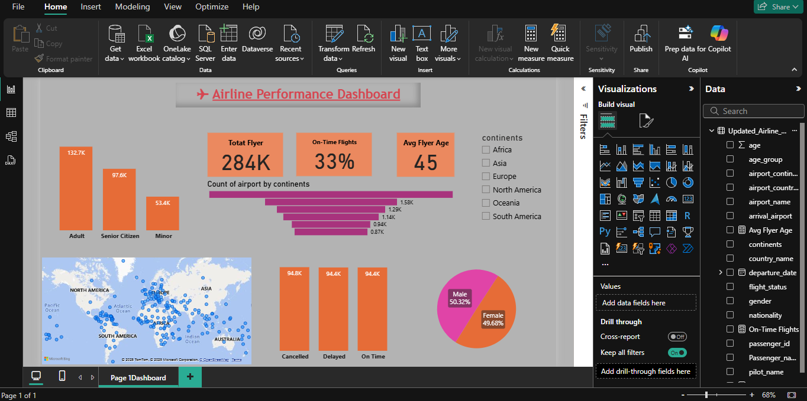

# ✈️ Airline Performance Dashboard - Power BI

A fully interactive Power BI dashboard analyzing global airline performance, built using a dataset of 98K+ passenger and flight records.

## 📊 Dashboard Highlights

- ✅ Total Flyers: **284K**
- ✅ Avg Flyer Age: **45**
- ✅ On-Time Flights: **33%**
- ✅ Gender Split: ~50-50
- ✅ Visual breakdowns by:
  - Age group (Adult, Senior, Minor)
  - Flight Status (On Time, Cancelled, Delayed)
  - Airport activity by Continent
  - Geographic distribution of flights

## 💼 Tools Used
- Amazon(S3, amazon sagemaker, Athena)
- Python
- ODBC
- SQL
- Microsoft Power BI
- DAX

## 🌍 Use Case

This dashboard can help airline management:
- Understand regional performance
- Improve operational efficiency
- Analyze flyer demographics

## 📷 Screenshots

## 📁 File Details

| File | Description |
|------|-------------|
| `Airline_Dataset_PowerBI.pbix` | Main Power BI file |
| `Airline Data/` | Datasets used |
| `screenshots/dashboard-desktop-view.png` | Dashboard preview |

---

**Created by:** Ankit Mishra  
**Connect with me on [LinkedIn](https://www.linkedin.com/in/ankit-mishra-anengneer)**  
